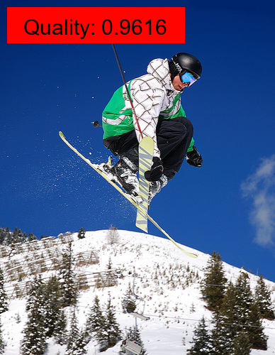
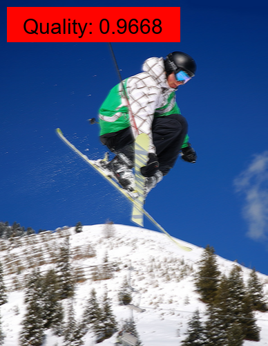
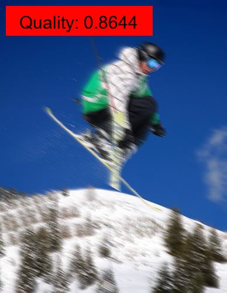
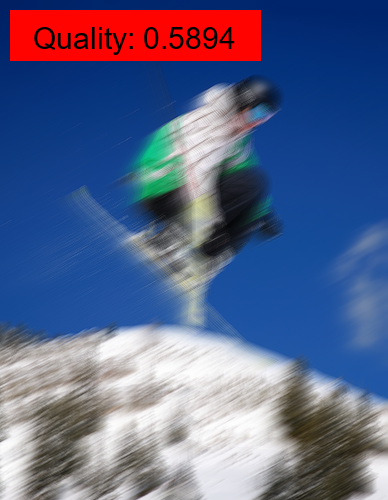
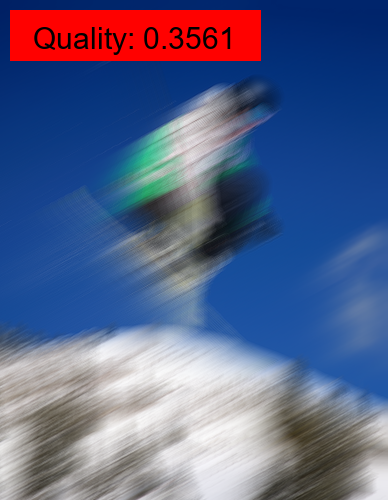
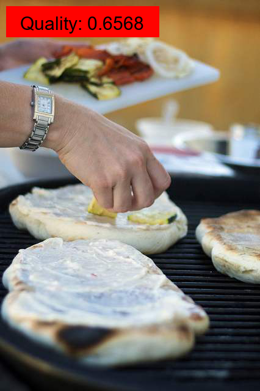
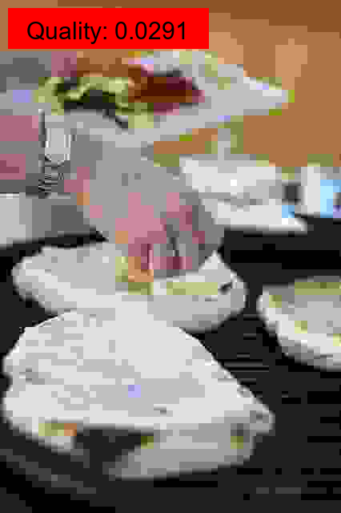
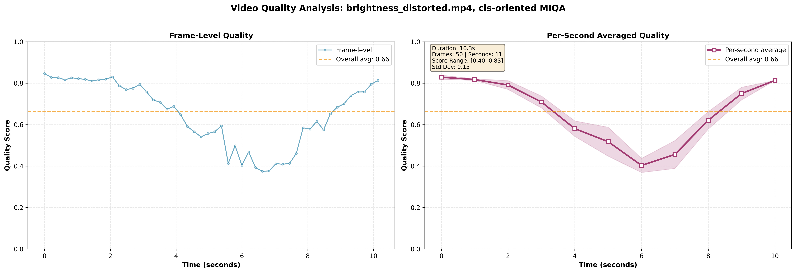
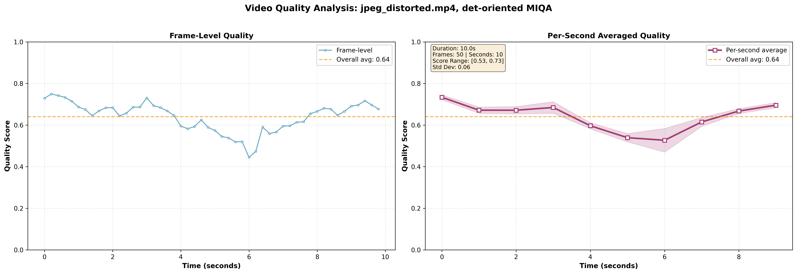
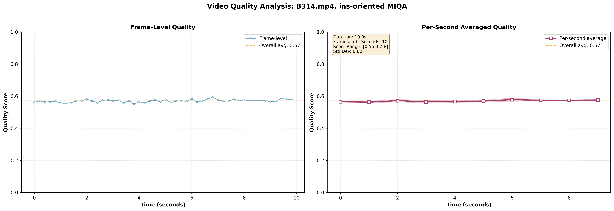

<div align="center">
  
  
  <h3><strong>面向机器的图像质量评估：新范式、大规模数据库与模型
</strong></h3> 

  [](https://github.com/XiaoqiWang/MIQD-2.5M)
  [](https://arxiv.org/abs/2508.19850)
  [](https://huggingface.co/)
  [](link-to-colab)
  
[中文](README_CN.md) | [English](README.md) | [Colab](colab-link) | [博客](blog-link)
</div>
<div style="font-size: 13px;">
🎯 项目概览

- 🤖 **以机器为中心**: 绕过人类的主观感知，完全从深度学习模型的视角来评估图像质量。
- 📈 **由任务驱动**: 直接衡量图像降质（如模糊、噪声、压缩失真）对下游视觉任务性能的真实影响。
- 💡 **全新范式**: MIQA 为优化面向机器决策的图像处理流程提供了一个全新的、更有效的视角。
</div>

---
<!--
## 🔥 **最新动态**
> 待办事项:
> 
> **[2025-XX-XX]** 📊 [数据集发布与下载说明](link-to-dataset)
>
> **[2025-XX-XX]** 📖 [可交互的 Colab 教程已上线](colab-link)
>
> **[2025-XX-XX]** 🤗 [模型已上传至 HuggingFace Hub](huggingface-link)
-->

## 🔬 研究背景
- **背景**: 机器视觉系统在理想环境下表现出色，但在真实世界的部署中，图像失真会严重降低其性能。传统的图像质量评估优先考虑人类的感知保真度，这与机器的“敏感点”存在根本性的错位。

- **核心优势**: 以机器为中心的评估框架，能够监控从图像采集、传输到处理的全过程质量，确保机器视觉系统在复杂条件下的性能可靠性，并为自动化视觉系统的优化提供关键支持。


## ✨ MIQA 是否有效？
<div align="center">
  
  
  
  <p><em>使用 MIQA 分数过滤低质量图像后，各项任务的性能均得到提升</em></p>
</div>

<details>
<summary> 🗝️ 核心结论</summary>

我们的研究结果清晰地证明了 MIQA 在三个代表性的计算机视觉任务（图像分类、目标检测和实例分割）上的有效性。

该框架能够持续准确地识别出那些会降低模型性能的图像。通过滤除这些有害样本，MIQA 直接提升了下游任务的最终成果，并证明了“以机器为中心”方法的普适价值。这使得质量评估从一个被动的度量标准，转变为一个主动的性能保障工具，保护下游模型免受真实世界中不可预测的图像质量影响，确保其在关键时刻的稳健表现。
</details>

---
## 🛠️ 安装指南

#### 第 1 步: 安装核心依赖

首先，您需要安装两个必要的库：**mmcv** 和 **mmsegmentation**。
<details>
<summary> 安装 mmcv 和 mmsegmentation</summary>

*   若要安装最新版本的 **mmsegmentation**，请遵循其官方安装指南：
    [MMsegmentation 安装指南](https://mmsegmentation.readthedocs.io/en/main/get_started.html)

*   您也可以根据自己的 CUDA 和 PyTorch 版本，安装特定版本的 **mmsegmentation**。版本兼容性详情请参考：
    [MMCV 安装指南](https://mmcv.readthedocs.io/zh_CN/latest/get_started/installation.html)

</details>

#### 第 2 步: 处理 CUDA 版本兼容性问题

如果您的 CUDA 版本较高（例如 12.7 或更高），可能会遇到与 **mmcv** 的版本不匹配问题。此时，您需要安装一个兼容的 **mmcv** 版本。
<details>
<summary> 安装一个兼容的 mmcv 版本</summary>

例如，您可以通过以下命令卸载现有版本并安装一个兼容的新版本：

```bash
pip uninstall mmcv mmcv-full -y
mim install "mmcv>=2.0.0rc4,<2.2.0"  # 注意：此处版本号仅为示例，请根据您的 CUDA 和 PyTorch 环境选择最合适的版本。
```
</details>

#### 第 3 步: 安装其他所需库

```bash
pip install -r requirements.txt
```

---

## 📦 模型权重与性能
<details open>
<summary> 综合指标 </summary>

| **方法**              | **图像分类** <br> (SRCC / PLCC 和下载链接) | **目标检测** <br> (SRCC / PLCC 和下载链接) | **实例分割** <br> (SRCC / PLCC 和下载链接) | **训练标签类型** |
|:--------------------|:---:|:---:|:---:|:---:|
| **ResNet-18**       | `0.5131 / 0.5427` <br> [**Google Drive**](https://drive.google.com/file/d/1zq03_TRYbg1zYEilP66x6HXpUUQ2sV_H/view?usp=sharing) | `0.7541 / 0.7734` <br> [**Google Drive**](https://drive.google.com/file/d/1_5mP7nOc2kla6l4QaTBBs5Xlj4hSu9dE/view?usp=sharing) | `0.7582 / 0.7790` <br> [**Google Drive**](https://drive.google.com/file/d/1umqAI4MiqfPK7dPiro6im_vDA_zrNfRO/view?usp=sharing) | 综合得分 |
| **ResNet-50**       | `0.5581 / 0.5797` <br> [**Google Drive**](https://drive.google.com/file/d/1y8cV_iOOVNIa66WaAxESqqaOLiCv-GAY/view?usp=sharing) | `0.7743 / 0.7925` <br> [**Google Drive**](https://drive.google.com/file/d/1qLiznF02he6VHEGUDkNr9p0M2-4xO3kr/view?usp=sharing) | `0.7729 / 0.7933` <br> [**Google Drive**](https://drive.google.com/file/d/1Q-zgOoUvXQb3cKtxgC8B9YtbH5YVtYyg/view?usp=sharing) | 综合得分 |
| **EfficientNet-b1** | `0.5901 / 0.6130` <br> [**Google Drive**](https://drive.google.com/file/d/1ERKTGO18AD2G1J-fr8zjvzoQpSbx6lAo/view?usp=sharing) | `0.7766 / 0.7950` <br> [**Google Drive**](https://drive.google.com/file/d/1vTKaEI_AG7Vnhmrn2B9Rkfblay-GyKvu/view?usp=sharing) | `0.7808 / 0.7999` <br> [**Google Drive**](https://drive.google.com/file/d/1aqun7dmtALkYwvhOSWzlnJByDHTPMQVn/view?usp=sharing) | 综合得分 |
| **EfficientNet-b5** | `0.6330 / 0.6440` <br> [**Google Drive**](https://drive.google.com/file/d/1utE5Rd8onzSlHeve0WYvgDwq4Kctl4zf/view?usp=sharing) | `0.7866 / 0.8041` <br> [**Google Drive**](https://drive.google.com/file/d/1Vx4KcZfisyrfoiZ5zHfBMJpugsFgB82p/view?usp=sharing) | `0.7899 / 0.8074` <br> [**Google Drive**](https://drive.google.com/file/d/1pi2-5Iat1qq0xP9H1vDdlcZBpN5-EUwB/view?usp=sharing) | 综合得分 |
| **ViT-small**       | `0.5998 / 0.6161` <br> [**Google Drive**](https://drive.google.com/file/d/11YSVK8rrjMfw3N8XAK_CqzQiL30SuOYZ/view?usp=sharing) | `0.7992 / 0.8142` <br> [**Google Drive**](https://drive.google.com/file/d/1-KUxxK3j0JflRp2oTKROLEVCBl5q21eF/view?usp=sharing) | `0.7968 / 0.8139` <br> [**Google Drive**](https://drive.google.com/file/d/10HcI61FEISLbmXME4knZEMBzQmOR8MVs/view?usp=sharing) | 综合得分 |
| **RA-MIQA**         | **`0.7003 / 0.6989`** <br> [**Google Drive**](https://drive.google.com/file/d/1n_NhJcnVpb8dC3B2UZ5ETl2-a96uK0Js/view?usp=sharing) | **`0.8125 / 0.8264`** <br> [**Google Drive**](https://drive.google.com/file/d/1zUcrPOvvYd4rquAm1Wilnh03d8Hj1EDe/view?usp=sharing) | **`0.8188 / 0.8340`** <br> [**Google Drive**](https://drive.google.com/file/d/1uvN9jEFuGK5PFQzjiuS9s7A0H9NXyOyc/view?usp=sharing) | 综合得分 |

</details>

<details>
<summary> 准确度指标 </summary>
 
| **方法**              | **图像分类** <br> (SRCC / PLCC 和下载链接) | **目标检测** <br> (SRCC / PLCC 和下载链接) | **实例分割** <br> (SRCC / PLCC 和下载链接) | **训练标签类型** |
|:--------------------|:---:|:---:|:---:|:---:|
| **ResNet-50**       | `0.4734 / 0.4411` <br> [**Google Drive**](https://drive.google.com/file/d/1mXzm-EuKhLY6zRW0jeVoBAi-kfGfGU0a/view?usp=sharing) | `0.6955 / 0.6898` <br> [**Google Drive**](https://drive.google.com/file/d/1e01vieTy4Fdgpqepoi1a1qpenpQLyfei/view?usp=sharing) | `0.6863 / 0.6847` <br> [**Google Drive**](https://drive.google.com/file/d/1qi9uCv_i3fAN6WVoYEHn6mI-BguFYEd-/view?usp=sharing) | 准确度得分 |
| **EfficientNet-b5** | `0.5586 / 0.5149` <br> [**Google Drive**](https://drive.google.com/file/d/1qz7Qwrpa6PSwtSgPczADsYf5tVOdujw3/view?usp=sharing) | `0.7042 / 0.6991` <br> [**Google Drive**](https://drive.google.com/file/d/1rH36SwceDQ4zSr_exWCvpL_G2AOnCLT-/view?usp=sharing) | `0.6933 / 0.6949` <br> [**Google Drive**](https://drive.google.com/file/d/1DzgEkhFB182XshMBrh_MsWNHQWOYB3Ea/view?usp=sharing) | 准确度得分 |
| **ViT-small**       | `0.5788 / 0.5197` <br> [**Google Drive**](https://drive.google.com/file/d/1fkROk-dQ63PdIeqiSIyrs7suDm_sJSFH/view?usp=sharing) | `0.7121 / 0.7052` <br> [**Google Drive**](https://drive.google.com/file/d/1K_b29iBLIx1AHCCNaNJUHYx_LT-1Rcwh/view?usp=sharing) | `0.7168 / 0.7146` <br> [**Google Drive**](https://drive.google.com/file/d/1Ft90uII_kfMLIHsIFJ4X8D4kI_jaxWC3/view?usp=sharing) | 准确度得分 |
| **RA-MIQA**         | **`0.6573 / 0.5823`** <br> [**Google Drive**](https://drive.google.com/file/d/1zVhc8Jl1TJYC7Th_4WvwpFiTwac6D6X0/view?usp=sharing) | **`0.7448 / 0.7370`** <br> [**Google Drive**](https://drive.google.com/file/d/1gGAM7Wr-65CtN4gUdoLU0ZvN-fdFbosD/view?usp=sharing) | **`0.7363 / 0.7327`** <br> [**Google Drive**](https://drive.google.com/file/d/1eR3ba5E-rbv6d08VBOXJ_EAUCDkVNGa9/view?usp=sharing) | 准确度得分 |

</details>

 
<details>
<summary> 一致性指标 </summary>

| **方法**              | **图像分类** <br> (SRCC / PLCC 和下载链接) | **目标检测** <br> (SRCC / PLCC 和下载链接) | **实例分割** <br> (SRCC / PLCC 和下载链接) | **训练标签类型** |
|:--------------------|:---:|:---:|:---:|:---:|
| **ResNet-50**       | `0.5989 / 0.6551` <br> [**Google Drive**](https://drive.google.com/file/d/1VUPGUNatYPTvF_q9iNJ0WUAMLmeCNdPi/view?usp=sharing) | `0.8252 / 0.5457` <br> [**Google Drive**](https://drive.google.com/file/d/1HV_YiDcMGd2GNQDZiJBjq9oJQ4mmkWXs/view?usp=sharing) | `0.8320 / 0.8480` <br> [**Google Drive**](https://drive.google.com/file/d/1IYpjSy2Mbr0EMw8kagPrMy3ZFd7ggNUw/view?usp=sharing) | 一致性得分 |
| **EfficientNet-b5** | `0.6774 / 0.7168` <br> [**Google Drive**](https://drive.google.com/file/d/1gao45m88gRzlY6jbcB3C0B3Y25eJpjvW/view?usp=sharing) | `0.8353 / 0.8530` <br> [**Google Drive**](https://drive.google.com/file/d/1stlveb-l4YfDW7Jd5HxqAvtkKoSpBVlO/view?usp=sharing) | `0.8419 / 0.8564` <br> [**Google Drive**](https://drive.google.com/file/d/1mbbalTCfZGvxR9zD03BhZCoOCfKOHYhp/view?usp=sharing) | 一致性得分 |
| **ViT-small**       | `0.6798 / 0.7189` <br> [**Google Drive**](https://drive.google.com/file/d/1ZoRfSGJzu4NrIg7LZ03cLZ5Pwml1Di4o/view?usp=sharing) | `0.8459 / 0.8620` <br> [**Google Drive**](https://drive.google.com/file/d/1yx7hMh3Bt0qEE_9oNcP5LO_SeBre7sde/view?usp=sharing) | `0.8487 / 0.8616` <br> [**Google Drive**](https://drive.google.com/file/d/10VmxqqvpWnd7uxE7mx8WcRqJQNM8dbFo/view?usp=sharing) | 一致性得分 |
| **RA-MIQA**         | **`0.7707 / 0.7866`** <br> [**Google Drive**](https://drive.google.com/file/d/1bJrNFAz4hWAP9wO680Kq36EhQ0oCl1sj/view?usp=sharing) | **`0.8526 / 0.8692`** <br> [**Google Drive**](https://drive.google.com/file/d/1TvyiN-DPtol0B7k2mo9bPXUoMjJ8F0Xn/view?usp=sharing) | **`0.8632 / 0.8756`** <br> [**Google Drive**](https://drive.google.com/file/d/1E9H7zerQgf2CUtLhttQBk70AsGb04hih/view?usp=sharing) | 一致性得分 |

</details>


## 🚀 快速开始

### 评估单张图像

使用命令行界面对单张图像进行 MIQA 推理：

```
# 评估一张用于“面向分类的MIQA”的图像

python img_inference.py --input path/to/image.jpg --task cls --model ra_miqa
```

### 评估图像目录

处理一个目录中的所有图像：

```
# 评估一个目录中的所有图像（例如，用于“面向检测的MIQA”）

python img_inference.py --input ./assets/demo_images/coco_demo --task det --model ra_miqa
```

### 保存结果与可视化
保存输出并生成可视化结果：
```
# 为单张图像保存预测分数和可视化结果
python img_inference.py --input path/to/image.jpg --task cls --model ra_miqa --save-results --visualize

# 为一个目录保存批量结果并生成可视化
python img_inference.py --input ./assets/demo_images/imagenet_demo --task ins --save-results --visualize
```
<details> <summary>📸 <b>MIQA 预测结果示例</b></summary> <p align="center"> 
 
 
 
 
 
</p> <p align="center"><em> 预训练模型: <b>RA-MIQA</b> | 训练标签: <b>综合得分</b> | 失真类型: <b>运动模糊</b> | 任务: <b>面向分类的MIQA</b> </em></p>
<p align="center">  
 
 
 
 
</p> <p align="center"><em> 预训练模型: <b>RA-MIQA</b> | 训练标签: <b>综合得分</b> | 失真类型: <b>JPEG 压缩</b> | 任务: <b>面向检测的MIQA</b> </em></p> 
</details>

### 🎬 视频评估

视频质量评估提供两种工作流： **(1) 逐帧标注**: 生成带有完整标注的视频，用于详细的视觉检查。这种方法适合演示和定性分析，但计算量较大。
**(2) 选择性采样与聚合**: 通过采样帧来生成图表和结构化数据（.json），用于高效的定量分析。这种方法是批量处理和生成报告的理想选择。
#### 分析单个视频 (**逐帧标注**)

对一个视频进行 MIQA 推理，并保存带标注的输出。
```bash
# 使用 RA-MIQA 评估单个视频（面向分类的MIQA）
python video_annotator_inference.py --input assets/demo_video/brightness_distorted.mp4 --task cls --model ra_miqa
```

#### 评估视频目录 (**逐帧标注**)
处理指定文件夹中的所有视频：

```bash
# 评估一个目录中的所有视频，用于面向目标检测的MIQA
python video_annotator_inference.py --input assets/demo_video/ --task det --model ra_miqa
```

主要输出是一个新的 `.mp4` 视频文件。该视频会同时播放原始画面和一个动态侧边栏，侧边栏会实时显示质量分数，并随着视频播放绘制一条折线图。

<details open>

<summary>🎥 <b>示例: 视频的逐帧MIQA预测</b></summary> 

| 亮度变化 | 压缩伪影 | 无明显感知失真 |
| :---: | :---: | :---: |
| <video src="https://github.com/user-attachments/assets/9b20cbc4-3baf-4d57-8d5f-49acd6873725" width="280" controls></video> | <video src="https://github.com/user-attachments/assets/c2fc142b-6889-4451-8a05-fb93e0ec0656" width="280" controls></video> | <video src="https://github.com/user-attachments/assets/14f4fc37-5ae5-4068-81f2-6f86bec30a27" width="280" controls></video> | 

</details>

#### 分析单个视频 (**选择性采样与聚合**)

为了进行高效的定量分析，此脚本会对视频进行帧采样，而不是处理所有帧。它速度快得多，专为生成分析报告而设计。

```bash
# 分析一个视频，采样帧，并创建一个双粒度图表
python video_analytics_inference.py --input assets/demo_video/gaussian_distorted.mp4 --task ins --visualize --viz-granularity both```
```

#### 评估视频目录 (**选择性采样与聚合**)

此工作流为批量处理进行了高度优化。

```bash
# 分析目录中的所有视频，每个视频采样120帧
python video_analytics_inference.py --input assets/demo_video/ --task det --video-frames 120 --visualize


python video_analytics_inference.py --input assets/demo_video/jpeg_distorted.mp4  --task det --visualize --viz-granularity both
# viz-granularity both : 指定要生成的图表类型。'composite' 会创建一个全面的并排比较图表，显示：
# 1. 原始的、逐帧的质量分数。 2. 平滑处理后的、每秒平均的质量分数。
```

这个过程**不会创建新的视频**，它会为每个分析的视频生成两个关键输出：
1.  一个 **`.png` 图像**: 一个详细的时间序列图，显示视频播放期间质量分数的波动。
2.  一个 **`.json` 文件**: 一个结构化数据文件，包含每秒的聚合分数、总体统计数据（平均值、最小值、最大值、标准差）和视频元数据。

<details>
<summary>📊 <b>示例: 视频的聚合MIQA分析</b></summary>

|                                           亮度变化视频预测结果                                            | 压缩伪影视频预测结果 |                                     无明显感知失真视频预测结果                                     |
|:-----------------------------------------------------------------------------------------------:| :---: |:-------------------------------------------------------------------------------:|
|  |  |  |
 
</details>

## 🏃 训练与评估

### 模型训练

```bash
CUDA_VISIBLE_DEVICES=0,1 python train.py \
      --dataset 'miqa_cls' \
      --path_miqa_cls 'path/to/datasets_miqa_cls' \
      --train_split_file '../data/dataset_splitting/miqa_cls_train.csv' \
      --val_split_file '../data/dataset_splitting//miqa_cls_val.csv' \
      --metric_type 'composite' --loss_name 'mse' --is_two_transform \
      -a 'RA-MIQA' --pretrained --transform_type 'simple_transform' \
      -b 256 --epochs 5 --warmup_epochs 1 --validate_num 2 --lr 1e-4 \
      --image_size 288 --crop_size 224 --workers 8 -p 100 \
      --multiprocessing-distributed --world-size 1 --rank 0
```
更多训练脚本请见 "**scripts**" 文件夹。

### 在标准基准上进行评估
 

```bash
# 在测试集上评估
python evaluate.py --model_name ra_miqa  --train_dataset cls  --test_dataset cls  --metric_type composite

# 跨数据集评估：评估在miqa_cls数据集上训练并在miqa_det数据集上测试
python evaluate.py --model_name ra_miqa  --train_dataset cls  --test_dataset det  --metric_type composite
```

## 📈 基准测试

<details>
<summary>表 1: 基于综合质量标签的基准测试</summary>

<table>
<thead>
<tr>
<th rowspan="2" style="text-align: center;">类别</th>
<th rowspan="2" style="text-align: left;">方法</th>
<th colspan="4" style="text-align: center;">图像分类</th>
<th colspan="4" style="text-align: center;">目标检测</th>
<th colspan="4" style="text-align: center;">实例分割</th>
</tr>
<tr>
<th style="text-align: center;">SRCC ↑</th>
<th style="text-align: center;">PLCC ↑</th>
<th style="text-align: center;">KRCC ↑</th>
<th style="text-align: center;">RMSE ↓</th>
<th style="text-align: center;">SRCC ↑</th>
<th style="text-align: center;">PLCC ↑</th>
<th style="text-align: center;">KRCC ↑</th>
<th style="text-align: center;">RMSE ↓</th>
<th style="text-align: center;">SRCC ↑</th>
<th style="text-align: center;">PLCC ↑</th>
<th style="text-align: center;">KRCC ↑</th>
<th style="text-align: center;">RMSE ↓</th>
</tr>
</thead>
<tbody>
<tr>
<td rowspan="7" style="text-align: center; vertical-align: middle;"><strong>基于人类视觉 (HVS-based)</strong></td>
<td style="text-align: left;">PSNR</td>
<td style="text-align: center;">0.2388</td>
<td style="text-align: center;">0.2292</td>
<td style="text-align: center;">0.1661</td>
<td style="text-align: center;">0.2928</td>
<td style="text-align: center;">0.3176</td>
<td style="text-align: center;">0.3456</td>
<td style="text-align: center;">0.2148</td>
<td style="text-align: center;">0.2660</td>
<td style="text-align: center;">0.3242</td>
<td style="text-align: center;">0.3530</td>
<td style="text-align: center;">0.2196</td>
<td style="text-align: center;">0.2553</td>
</tr>
<tr>
<td style="text-align: left;">SSIM</td>
<td style="text-align: center;">0.3027</td>
<td style="text-align: center;">0.2956</td>
<td style="text-align: center;">0.2119</td>
<td style="text-align: center;">0.2874</td>
<td style="text-align: center;">0.4390</td>
<td style="text-align: center;">0.4505</td>
<td style="text-align: center;">0.3011</td>
<td style="text-align: center;">0.2531</td>
<td style="text-align: center;">0.4391</td>
<td style="text-align: center;">0.4512</td>
<td style="text-align: center;">0.3011</td>
<td style="text-align: center;">0.2435</td>
</tr>
<tr>
<td style="text-align: left;">VSI</td>
<td style="text-align: center;">0.3592</td>
<td style="text-align: center;">0.3520</td>
<td style="text-align: center;">0.2520</td>
<td style="text-align: center;">0.2816</td>
<td style="text-align: center;">0.4874</td>
<td style="text-align: center;">0.4940</td>
<td style="text-align: center;">0.3355</td>
<td style="text-align: center;">0.2465</td>
<td style="text-align: center;">0.4919</td>
<td style="text-align: center;">0.4985</td>
<td style="text-align: center;">0.3392</td>
<td style="text-align: center;">0.2365</td>
</tr>
<tr>
<td style="text-align: left;">LPIPS</td>
<td style="text-align: center;">0.3214</td>
<td style="text-align: center;">0.3280</td>
<td style="text-align: center;">0.2258</td>
<td style="text-align: center;">0.2842</td>
<td style="text-align: center;">0.5264</td>
<td style="text-align: center;"><strong>0.5376</strong></td>
<td style="text-align: center;"><strong>0.3697</strong></td>
<td style="text-align: center;"><strong>0.2390</strong></td>
<td style="text-align: center;">0.5342</td>
<td style="text-align: center;"><strong>0.5453</strong></td>
<td style="text-align: center;"><strong>0.3754</strong></td>
<td style="text-align: center;"><strong>0.2287</strong></td>
</tr>
<tr>
<td style="text-align: left;">DISTS</td>
<td style="text-align: center;"><strong>0.3878</strong></td>
<td style="text-align: center;"><strong>0.3804</strong></td>
<td style="text-align: center;"><strong>0.2724</strong></td>
<td style="text-align: center;"><strong>0.2782</strong></td>
<td style="text-align: center;"><strong>0.5266</strong></td>
<td style="text-align: center;">0.5352</td>
<td style="text-align: center;">0.3659</td>
<td style="text-align: center;">0.2395</td>
<td style="text-align: center;"><strong>0.5363</strong></td>
<td style="text-align: center;">0.5450</td>
<td style="text-align: center;">0.3738</td>
<td style="text-align: center;">0.2288</td>
</tr>
<tr>
<td style="text-align: left;">HyperIQA</td>
<td style="text-align: center;">0.2496</td>
<td style="text-align: center;">0.2279</td>
<td style="text-align: center;">0.1741</td>
<td style="text-align: center;">0.2929</td>
<td style="text-align: center;">0.4462</td>
<td style="text-align: center;">0.4463</td>
<td style="text-align: center;">0.3031</td>
<td style="text-align: center;">0.2537</td>
<td style="text-align: center;">0.4456</td>
<td style="text-align: center;">0.4518</td>
<td style="text-align: center;">0.3031</td>
<td style="text-align: center;">0.2434</td>
</tr>
<tr>
<td style="text-align: left;">MANIQA</td>
<td style="text-align: center;">0.3403</td>
<td style="text-align: center;">0.3255</td>
<td style="text-align: center;">0.2387</td>
<td style="text-align: center;">0.2844</td>
<td style="text-align: center;">0.4574</td>
<td style="text-align: center;">0.4617</td>
<td style="text-align: center;">0.3124</td>
<td style="text-align: center;">0.2515</td>
<td style="text-align: center;">0.4636</td>
<td style="text-align: center;">0.4680</td>
<td style="text-align: center;">0.3176</td>
<td style="text-align: center;">0.2411</td>
</tr>
<tr>

</tr>
<tr>
<td rowspan="6" style="text-align: center; vertical-align: middle;"><strong>基于机器 (Machine-based)</strong></td>
<td style="text-align: left;">ResNet-18</td>
<td style="text-align: center;">0.5131</td>
<td style="text-align: center;">0.5427</td>
<td style="text-align: center;">0.3715</td>
<td style="text-align: center;">0.2527</td>
<td style="text-align: center;">0.7541</td>
<td style="text-align: center;">0.7734</td>
<td style="text-align: center;">0.5625</td>
<td style="text-align: center;">0.1797</td>
<td style="text-align: center;">0.7582</td>
<td style="text-align: center;">0.7790</td>
<td style="text-align: center;">0.5674</td>
<td style="text-align: center;">0.1711</td>
</tr>
<tr>
<td style="text-align: left;">ResNet-50</td>
<td style="text-align: center;">0.5581</td>
<td style="text-align: center;">0.5797</td>
<td style="text-align: center;">0.4062</td>
<td style="text-align: center;">0.2451</td>
<td style="text-align: center;">0.7743</td>
<td style="text-align: center;">0.7925</td>
<td style="text-align: center;">0.5824</td>
<td style="text-align: center;">0.1729</td>
<td style="text-align: center;">0.7729</td>
<td style="text-align: center;">0.7933</td>
<td style="text-align: center;">0.5826</td>
<td style="text-align: center;">0.1661</td>
</tr>
<tr>
<td style="text-align: left;">EfficientNet-b1</td>
<td style="text-align: center;">0.5901</td>
<td style="text-align: center;">0.6130</td>
<td style="text-align: center;">0.4320</td>
<td style="text-align: center;">0.2377</td>
<td style="text-align: center;">0.7766</td>
<td style="text-align: center;">0.7950</td>
<td style="text-align: center;">0.5859</td>
<td style="text-align: center;">0.1720</td>
<td style="text-align: center;">0.7808</td>
<td style="text-align: center;">0.7999</td>
<td style="text-align: center;">0.5918</td>
<td style="text-align: center;">0.1637</td>
</tr>
<tr>
<td style="text-align: left;">EfficientNet-b5</td>
<td style="text-align: center;">0.6330</td>
<td style="text-align: center;">0.6440</td>
<td style="text-align: center;">0.4680</td>
<td style="text-align: center;">0.2301</td>
<td style="text-align: center;">0.7866</td>
<td style="text-align: center;">0.8041</td>
<td style="text-align: center;">0.5971</td>
<td style="text-align: center;">0.1685</td>
<td style="text-align: center;">0.7899</td>
<td style="text-align: center;">0.8074</td>
<td style="text-align: center;">0.6013</td>
<td style="text-align: center;">0.1610</td>
</tr>
<tr>
<td style="text-align: left;">ViT-small</td>
<td style="text-align: center;">0.5998</td>
<td style="text-align: center;">0.6161</td>
<td style="text-align: center;">0.4407</td>
<td style="text-align: center;">0.2370</td>
<td style="text-align: center;">0.7992</td>
<td style="text-align: center;">0.8142</td>
<td style="text-align: center;">0.6099</td>
<td style="text-align: center;">0.1646</td>
<td style="text-align: center;">0.7968</td>
<td style="text-align: center;">0.8139</td>
<td style="text-align: center;">0.6083</td>
<td style="text-align: center;">0.1585</td>
</tr>
<tr style="background-color: #f0f8ff;">
<td style="text-align: left;"><strong>RA-MIQA (Ours)</strong></td>
<td style="text-align: center;"><strong>0.7003</strong></td>
<td style="text-align: center;"><strong>0.6989</strong></td>
<td style="text-align: center;"><strong>0.5255</strong></td>
<td style="text-align: center;"><strong>0.2152</strong></td>
<td style="text-align: center;"><strong>0.8125</strong></td>
<td style="text-align: center;"><strong>0.8264</strong></td>
<td style="text-align: center;"><strong>0.6263</strong></td>
<td style="text-align: center;"><strong>0.1596</strong></td>
<td style="text-align: center;"><strong>0.8188</strong></td>
<td style="text-align: center;"><strong>0.8340</strong></td>
<td style="text-align: center;"><strong>0.6333</strong></td>
<td style="text-align: center;"><strong>0.1505</strong></td>
</tr>
</tbody>
</table>

</details>

<details>
<summary>表 2: 一致性与准确性得分基准测试</summary>
<table>
<thead>
<tr>
<th rowspan="3" style="text-align: center; vertical-align: middle;">方法</th>
<th colspan="6" style="text-align: center;">图像分类</th>
<th colspan="6" style="text-align: center;">目标检测</th>
<th colspan="6" style="text-align: center;">实例分割</th>
</tr>
<tr>
<th colspan="3" style="text-align: center;">准确性得分</th>
<th colspan="3" style="text-align: center;">一致性得分</th>
<th colspan="3" style="text-align: center;">准确性得分</th>
<th colspan="3" style="text-align: center;">一致性得分</th>
<th colspan="3" style="text-align: center;">准确性得分</th>
<th colspan="3" style="text-align: center;">一致性得分</th>
</tr>
<tr>
<th style="text-align: center;">SRCC ↑</th>
<th style="text-align: center;">PLCC ↑</th>
<th style="text-align: center;">RMSE ↓</th>
<th style="text-align: center;">SRCC ↑</th>
<th style="text-align: center;">PLCC ↑</th>
<th style="text-align: center;">RMSE ↓</th>
<th style="text-align: center;">SRCC ↑</th>
<th style="text-align: center;">PLCC ↑</th>
<th style="text-align: center;">RMSE ↓</th>
<th style="text-align: center;">SRCC ↑</th>
<th style="text-align: center;">PLCC ↑</th>
<th style="text-align: center;">RMSE ↓</th>
<th style="text-align: center;">SRCC ↑</th>
<th style="text-align: center;">PLCC ↑</th>
<th style="text-align: center;">RMSE ↓</th>
<th style="text-align: center;">SRCC ↑</th>
<th style="text-align: center;">PLCC ↑</th>
<th style="text-align: center;">RMSE ↓</th>
</tr>
</thead>
<tbody>
<tr><td colspan="19" style="font-weight: bold; text-align: left; padding-top: 8px; padding-bottom: 4px; border-bottom: 1px solid #ddd;"><em>基于人类视觉 (HVS-based)</em></td></tr>
<tr>
<td style="text-align: left;">PSNR</td>
<td style="text-align: center;">0.2034</td>
<td style="text-align: center;">0.1620</td>
<td style="text-align: center;">0.3541</td>
<td style="text-align: center;">0.2927</td>
<td style="text-align: center;">0.2812</td>
<td style="text-align: center;">0.2692</td>
<td style="text-align: center;">0.2234</td>
<td style="text-align: center;">0.2449</td>
<td style="text-align: center;">0.2747</td>
<td style="text-align: center;">0.3712</td>
<td style="text-align: center;">0.3933</td>
<td style="text-align: center;">0.2839</td>
<td style="text-align: center;">0.2182</td>
<td style="text-align: center;">0.2398</td>
<td style="text-align: center;">0.2616</td>
<td style="text-align: center;">0.3796</td>
<td style="text-align: center;">0.4061</td>
<td style="text-align: center;">0.2770</td>
</tr>
<tr>
<td style="text-align: left;">SSIM</td>
<td style="text-align: center;">0.2529</td>
<td style="text-align: center;">0.2101</td>
<td style="text-align: center;">0.3509</td>
<td style="text-align: center;">0.3740</td>
<td style="text-align: center;">0.3663</td>
<td style="text-align: center;">0.2610</td>
<td style="text-align: center;">0.3434</td>
<td style="text-align: center;">0.3419</td>
<td style="text-align: center;">0.2662</td>
<td style="text-align: center;">0.5128</td>
<td style="text-align: center;">0.5130</td>
<td style="text-align: center;">0.2651</td>
<td style="text-align: center;">0.3271</td>
<td style="text-align: center;">0.3284</td>
<td style="text-align: center;">0.2545</td>
<td style="text-align: center;">0.5174</td>
<td style="text-align: center;">0.5204</td>
<td style="text-align: center;">0.2589</td>
</tr>
<tr>
<td style="text-align: left;">VSI</td>
<td style="text-align: center;">0.3020</td>
<td style="text-align: center;">0.2515</td>
<td style="text-align: center;">0.3473</td>
<td style="text-align: center;">0.4392</td>
<td style="text-align: center;">0.4336</td>
<td style="text-align: center;">0.2528</td>
<td style="text-align: center;">0.3799</td>
<td style="text-align: center;">0.3685</td>
<td style="text-align: center;">0.2634</td>
<td style="text-align: center;">0.5700</td>
<td style="text-align: center;">0.5571</td>
<td style="text-align: center;">0.2565</td>
<td style="text-align: center;">0.3703</td>
<td style="text-align: center;">0.3645</td>
<td style="text-align: center;">0.2509</td>
<td style="text-align: center;">0.5757</td>
<td style="text-align: center;">0.5749</td>
<td style="text-align: center;">0.2481</td>
</tr>
<tr>
<td style="text-align: left;">LPIPS</td>
<td style="text-align: center;">0.2680</td>
<td style="text-align: center;">0.2355</td>
<td style="text-align: center;">0.3488</td>
<td style="text-align: center;">0.3927</td>
<td style="text-align: center;">0.4032</td>
<td style="text-align: center;">0.2567</td>
<td style="text-align: center;">0.4064</td>
<td style="text-align: center;">0.3987</td>
<td style="text-align: center;">0.2598</td>
<td style="text-align: center;"><strong>0.6196</strong></td>
<td style="text-align: center;"><strong>0.6232</strong></td>
<td style="text-align: center;"><strong>0.2415</strong></td>
<td style="text-align: center;">0.3972</td>
<td style="text-align: center;">0.3941</td>
<td style="text-align: center;">0.2476</td>
<td style="text-align: center;"><strong>0.6300</strong></td>
<td style="text-align: center;"><strong>0.6344</strong></td>
<td style="text-align: center;"><strong>0.2344</strong></td>
</tr>
<tr>
<td style="text-align: left;">DISTS</td>
<td style="text-align: center;"><strong>0.3291</strong></td>
<td style="text-align: center;"><strong>0.2768</strong></td>
<td style="text-align: center;"><strong>0.3448</strong></td>
<td style="text-align: center;"><strong>0.4683</strong></td>
<td style="text-align: center;"><strong>0.4628</strong></td>
<td style="text-align: center;"><strong>0.2487</strong></td>
<td style="text-align: center;"><strong>0.4089</strong></td>
<td style="text-align: center;"><strong>0.3999</strong></td>
<td style="text-align: center;"><strong>0.2597</strong></td>
<td style="text-align: center;">0.6174</td>
<td style="text-align: center;">0.6178</td>
<td style="text-align: center;">0.2429</td>
<td style="text-align: center;"><strong>0.4069</strong></td>
<td style="text-align: center;"><strong>0.4012</strong></td>
<td style="text-align: center;"><strong>0.2468</strong></td>
<td style="text-align: center;">0.6255</td>
<td style="text-align: center;">0.6270</td>
<td style="text-align: center;">0.2362</td>
</tr>
<tr>
<td style="text-align: left;">HyperIQA</td>
<td style="text-align: center;">0.2100</td>
<td style="text-align: center;">0.1649</td>
<td style="text-align: center;">0.3540</td>
<td style="text-align: center;">0.2966</td>
<td style="text-align: center;">0.2777</td>
<td style="text-align: center;">0.2695</td>
<td style="text-align: center;">0.3646</td>
<td style="text-align: center;">0.3545</td>
<td style="text-align: center;">0.2649</td>
<td style="text-align: center;">0.5009</td>
<td style="text-align: center;">0.4943</td>
<td style="text-align: center;">0.2684</td>
<td style="text-align: center;">0.3486</td>
<td style="text-align: center;">0.3442</td>
<td style="text-align: center;">0.2530</td>
<td style="text-align: center;">0.5056</td>
<td style="text-align: center;">0.4995</td>
<td style="text-align: center;">0.2626</td>
</tr>
<tr>
<td style="text-align: left;">MANIQA</td>
<td style="text-align: center;">0.2924</td>
<td style="text-align: center;">0.2435</td>
<td style="text-align: center;">0.3481</td>
<td style="text-align: center;">0.3963</td>
<td style="text-align: center;">0.3870</td>
<td style="text-align: center;">0.2587</td>
<td style="text-align: center;">0.3839</td>
<td style="text-align: center;">0.3823</td>
<td style="text-align: center;">0.2618</td>
<td style="text-align: center;">0.4991</td>
<td style="text-align: center;">0.4975</td>
<td style="text-align: center;">0.2679</td>
<td style="text-align: center;">0.3755</td>
<td style="text-align: center;">0.3749</td>
<td style="text-align: center;">0.2498</td>
<td style="text-align: center;">0.5096</td>
<td style="text-align: center;">0.5098</td>
<td style="text-align: center;">0.2608</td>
</tr>
<tr><td colspan="19" style="font-weight: bold; text-align: left; padding-top: 8px; padding-bottom: 4px; border-bottom: 1px solid #ddd;"><em>基于机器 (Machine-based)</em></td></tr>
<tr>
<td style="text-align: left;">ResNet-50</td>
<td style="text-align: center;">0.4734</td>
<td style="text-align: center;">0.4411</td>
<td style="text-align: center;">0.3221</td>
<td style="text-align: center;">0.5989</td>
<td style="text-align: center;">0.6551</td>
<td style="text-align: center;">0.2119</td>
<td style="text-align: center;">0.6955</td>
<td style="text-align: center;">0.6898</td>
<td style="text-align: center;">0.2051</td>
<td style="text-align: center;">0.8252</td>
<td style="text-align: center;">0.8457</td>
<td style="text-align: center;">0.1648</td>
<td style="text-align: center;">0.6863</td>
<td style="text-align: center;">0.6847</td>
<td style="text-align: center;">0.1964</td>
<td style="text-align: center;">0.8320</td>
<td style="text-align: center;">0.8480</td>
<td style="text-align: center;">0.1607</td>
</tr>
<tr>
<td style="text-align: left;">EfficientNet-b5</td>
<td style="text-align: center;">0.5586</td>
<td style="text-align: center;">0.5149</td>
<td style="text-align: center;">0.3076</td>
<td style="text-align: center;">0.6774</td>
<td style="text-align: center;">0.7168</td>
<td style="text-align: center;">0.1956</td>
<td style="text-align: center;">0.7042</td>
<td style="text-align: center;">0.6991</td>
<td style="text-align: center;">0.2026</td>
<td style="text-align: center;">0.8353</td>
<td style="text-align: center;">0.8530</td>
<td style="text-align: center;">0.1612</td>
<td style="text-align: center;">0.6933</td>
<td style="text-align: center;">0.6949</td>
<td style="text-align: center;">0.1938</td>
<td style="text-align: center;">0.8419</td>
<td style="text-align: center;">0.8564</td>
<td style="text-align: center;">0.1565</td>
</tr>
<tr>
<td style="text-align: left;">ViT-small</td>
<td style="text-align: center;">0.5788</td>
<td style="text-align: center;">0.5197</td>
<td style="text-align: center;">0.3066</td>
<td style="text-align: center;">0.6798</td>
<td style="text-align: center;">0.7189</td>
<td style="text-align: center;">0.1950</td>
<td style="text-align: center;">0.7121</td>
<td style="text-align: center;">0.7052</td>
<td style="text-align: center;">0.2008</td>
<td style="text-align: center;">0.8459</td>
<td style="text-align: center;">0.8620</td>
<td style="text-align: center;">0.1566</td>
<td style="text-align: center;">0.7168</td>
<td style="text-align: center;">0.7146</td>
<td style="text-align: center;">0.1885</td>
<td style="text-align: center;">0.8487</td>
<td style="text-align: center;">0.8616</td>
<td style="text-align: center;">0.1539</td>
</tr>
<tr style="background-color: #f0f8ff;">
<td style="text-align: left;"><strong>RA-MIQA</strong></td>
<td style="text-align: center;"><strong>0.6573</strong></td>
<td style="text-align: center;"><strong>0.5823</strong></td>
<td style="text-align: center;"><strong>0.2917</strong></td>
<td style="text-align: center;"><strong>0.7707</strong></td>
<td style="text-align: center;"><strong>0.7866</strong></td>
<td style="text-align: center;"><strong>0.1732</strong></td>
<td style="text-align: center;"><strong>0.7448</strong></td>
<td style="text-align: center;"><strong>0.7370</strong></td>
<td style="text-align: center;"><strong>0.1915</strong></td>
<td style="text-align: center;"><strong>0.8526</strong></td>
<td style="text-align: center;"><strong>0.8692</strong></td>
<td style="text-align: center;"><strong>0.1527</strong></td>
<td style="text-align: center;"><strong>0.7363</strong></td>
<td style="text-align: center;"><strong>0.7327</strong></td>
<td style="text-align: center;"><strong>0.1834</strong></td>
<td style="text-align: center;"><strong>0.8632</strong></td>
<td style="text-align: center;"><strong>0.8756</strong></td>
<td style="text-align: center;"><strong>0.1464</strong></td>
</tr>
</tbody>
</table>
</details> 


## 📚 引用

如果本研究对您的工作有所帮助，请考虑引用我们的论文：

```bibtex
@article{wang2025miqa,
  title={Image Quality Assessment for Machines: Paradigm, Large-scale Database, and Models},
  author={Wang, Xiaoqi and Zhang, Yun and Lin, Weisi},
  journal={arXiv preprint arXiv:2508.19850},
  year={2025}
}
```
### ⚠️ 仓库声明

此仓库是原始项目的副本，未来可能不会进行更新。

所有开发、维护和未来更新都在官方仓库进行：

👉 https://github.com/XiaoqiWang/MIQA

请访问原始项目以获取最新的代码、文档和问题跟踪信息。
